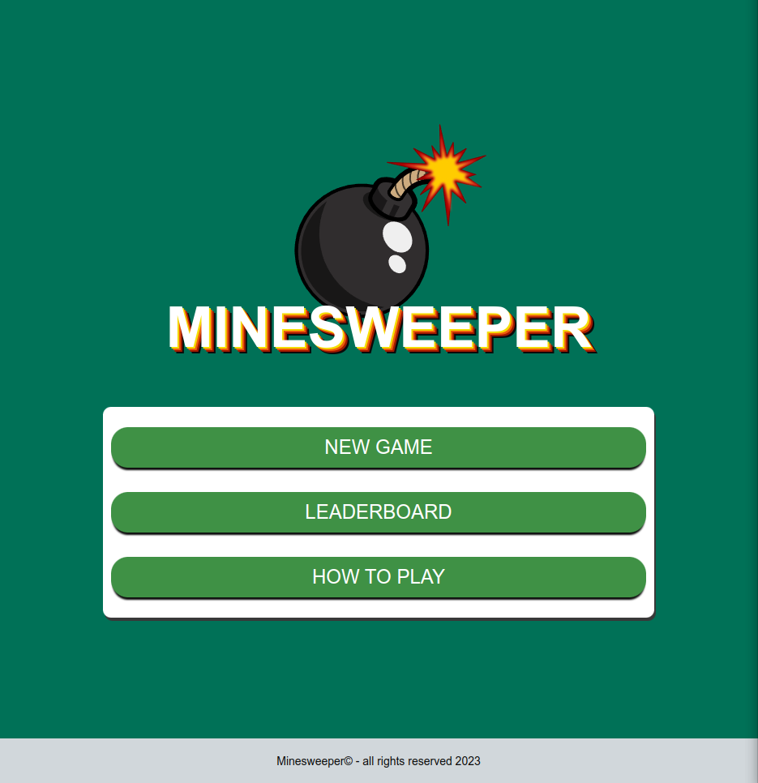
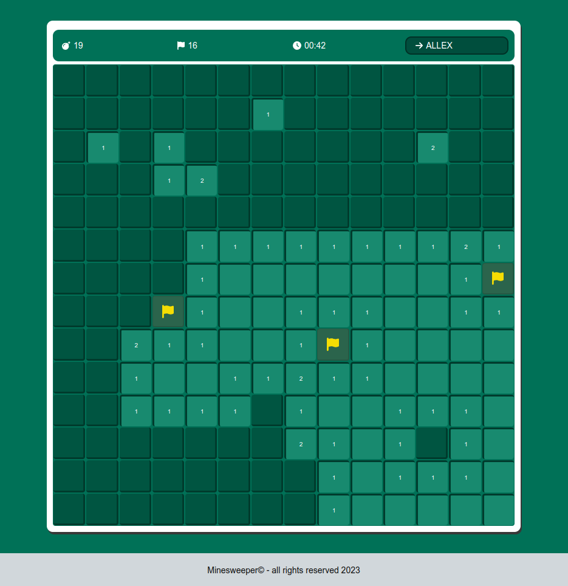

# Minesweeper Classic Game

Minesweeper is a classic 90's game where the objective is to reveal all the tiles of the grid without detonating any hidden mines. The grid consists of a number of tiles, some of which contain hidden mines. Your task as the player is to click on each tile to uncover them and use the revealed numbers to deduce the location of the hidden mines.

The objective of this project is to recreate this classic game using React.js, maintaining its original characteristics and adding new features. This version has 2 game modes: Single Player and Multiplayer.

In the `single player` mode, you will play against the clock, trying to reveal all the cells in the grid without triggering any mines and in the shortest time possible. In `multiplayer` mode, 2 players will make their moves in alternating turns. The winner is the one who reveals the last cell or survives for the longest time.

## Running the project

Before you begin, you will need to have `Git` and `Node.js` installed on your machine. Once you have the prerequisites, simply open a command terminal and follow the steps below:

```
    $ git clone https://github.com/allexrm/minesweeper.git
    $ cd minesweeper
    $ npm install
    $ npm run dev
```

The project was developed to run only locally, with no communication with servers. To simulate communication with a REST API, a `hook` called `useApiController` was created, which uses `localStorage` to persist data and returns a collection of asynchronous methods that enable interaction with this data.
## Screenshots


